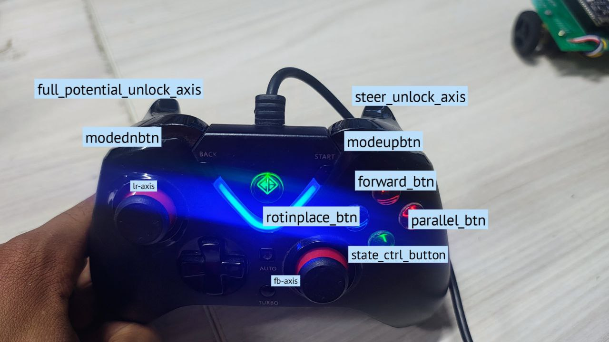
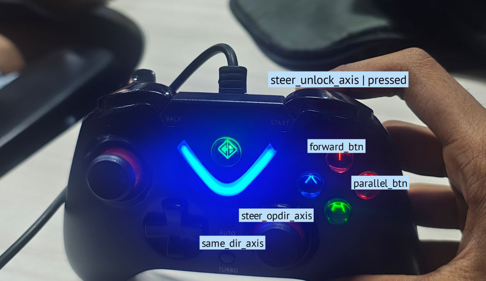
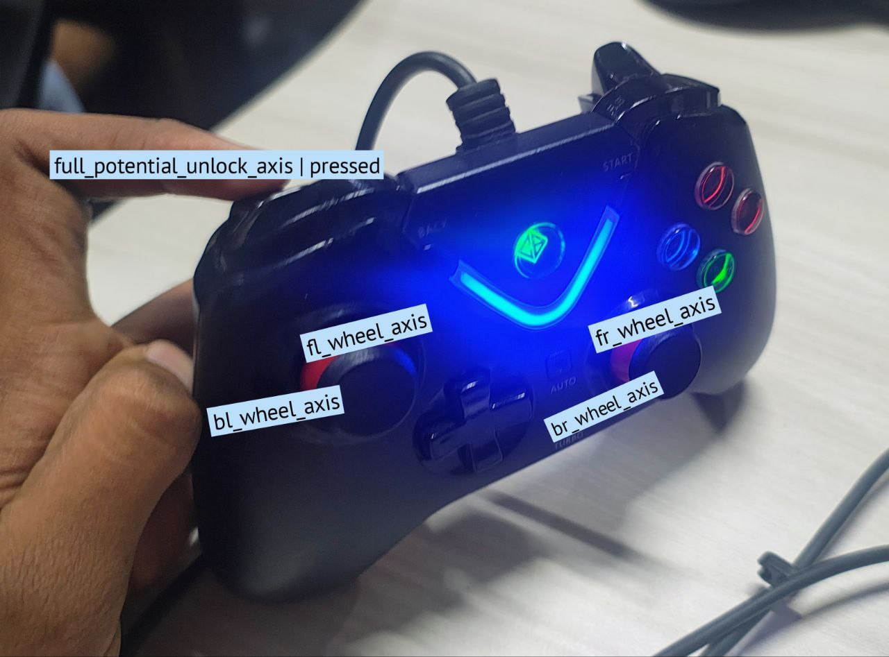

# Readme

## Overview 
this file explains Full_Potential_Steering.py file 

## ROS Message Types Used

### `sensor_msgs/Joy` Message

Reports the state of joystick axes and buttons.  
**Message structure:**

```
Header  header         
float32[] axes         # the axes measurements from a joystick  
int32[] buttons        # the buttons measurements from a joystick
```

**Example:**

```
Header: 
  stamp: 
    secs: 1722450542
    nsecs: 123456789
Axes: [0.0, -1.0, 0.5, 0.0]       # e.g., left stick Y fully down, right stick X halfway  
Buttons: [0, 1, 0, 1, 0, 0]       # e.g., Button 1 and 3 are pressed
```

---

### `std_msgs/Int32MultiArray`

Used to send PWM data.
Structure of `pwm_msg`:

```
[fld, frd, bld, brd, fls, frs, bls, brs]
```

* `fld = front left drive` (all integer values)

---

### `std_msgs/Float32MultiArray`

Used to receive encoder data from an external node.

---

## flow of code


## Joystick Button and Axis Mapping

| Name                         | Purpose                             |
| ---------------------------- | ----------------------------------- |
| `steer_unlock_axis`          | Pressing it puts in configuration 2 |
| `full_potential_unlock_axis` | Pressing it puts in configuration 3 |

> Full potential is locked if steer is unlocked and vice versa.

---

### Configuration 1

| Name                | Purpose                              |
| ------------------- | ------------------------------------ |
| `forward_btn`       | Turn all wheels to face forward      |
| `parallel_btn`      | Turn all wheels by 90° clockwise     |
| `rotinplace_btn`    | Rotate rover in place (crab)         |
| `fb_axis`           | Control forward/backward motion      |
| `lr_axis`           | Control left/right motion            |
| `rot_with_pwm`      | Manually rotate using PWM (in-place) |
| `state_ctrl_button` | Change to joystick/autonomous mode   |



---

### Configuration 2

| Name                 | Purpose                                                      |
| -------------------- | ------------------------------------------------------------ |
| `forward_btn`        | Steer all wheels clockwise to 45° (forward direction)        |
| `parallel_btn`       | Steer all wheels anticlockwise to 45° (sideways direction)   |
| `steer_samedir_axis` | Manually control all steering wheels in same direction (PWM) |
| `steer_oppdir_axis`  | Rotate front wheels clockwise, back wheels anticlockwise     |



---

### Configuration 3

| Name            | Purpose                                     |
| --------------- | ------------------------------------------- |
| `fl_wheel_axis` | Manually control front-left steering motor  |
| `fr_wheel_axis` | Manually control front-right steering motor |
| `bl_wheel_axis` | Manually control back-left steering motor   |
| `br_wheel_axis` | Manually control back-right steering motor  |



---

## `joyCallback`

### `self.mode`

Integer variable storing current **drive mode** level (`0` to `3`):

* Press `modeupbtn` → `self.mode`++
* Press `modednbtn` → `self.mode`--

### `self.state`

Boolean variable to toggle between **joystick** and **autonomous** mode:

* If `self.state == False` → run `steering()` → `drive()`
* If `self.state == True` → run `drive()` only

---

### Configuration 1: both locked

* `steering_ctrl_locked`: state of `forward_btn`, `parallel_btn`, `rotinplace_btn`
* `drive_ctrl`: joystick axis values for `fb_axis` and `lr_axis`
* `rot_with_pwm`: axis value to enable manual rotation using PWM

---

### Configuration 2: steer unlocked

* `steering_ctrl_unlocked`: state of `forward_btn`, `parallel_btn`
* `steering_ctrl_pwm`: values of `steer_samedir_axis` and `steer_oppdir_axis` for manual PWM steering

---

### Configuration 3: full potential unlocked

* `full_potential_pwm`: axis values = `[fl_wheel_axis, fr_wheel_axis, bl_wheel_axis, br_wheel_axis]`

---

## `EncCallback`

Encoder data is received as `Float32MultiArray` from another node.
It is stored in `enc_data` as:

| Index | Wheel                |
| ----- | -------------------- |
| 0     | Front Left encoder   |
| 1     | **-1 × Front Right** |
| 2     | **-1 × Back Left**   |
| 3     | Back Right encoder   |

> Negation ensures consistent encoder polarity.

---

## `Steering()`

### `Steer()`

**Attributes:**

* `initial_angles`, `final_angles`, `mode`
 
mode == 0 :  relative movement -> steer each wheel to go final angle away from initial_angle

mode == 1 :  absolute movement -> steer each wheel by absolute angles  

It steers until all 4 wheels are inside of an error threshold (also breaks if exceeds time threshold).

PWM is computed using proportional controller kp_steer and pwm_msg is published.

Then at the end, it puts steering_complete flag as True.


```python
self.pwm_msg.data = [
    0, 0, 0, 0,                    # Drive motors (not used here)
    pwm[0] * self.init_dir[4],    # Front Left Steering
    pwm[1] * self.init_dir[5],    # Front Right Steering
    pwm[2] * self.init_dir[6],    # Back Left Steering
    pwm[3] * self.init_dir[7]     # Back Right Steering
]
```

> `init_dir` is used to flip motor directions if needed.

---

### Configuration 1: both locked

* `forward_btn` → call `steer()` with `final_angle = initial_angle`
* `parallel_btn` → call `steer()` with `final_angles = [90, 90, 90, 90]`
* `rotinplace_btn` → `final_angles = [45, -45, -45, 45]` and set `rotinplace = True`
* `rot_with_pwm` (axis) → generate manual PWM, no `steer()` call

---

### Configuration 2: steer unlocked

> `_enc_data_new = copy.deepcopy(self.enc_data)`
> Used to ensure deep copy (not pointer) for `initial_angles`.

* `forward_btn` → steer all wheels to `+45°`
* `parallel_btn` → steer all wheels  to `-45°`
* `steer_same_dir_axis` → is moved → manually control all wheels with the same PWM (as in `forward_btn` case, but without calling `steer()`)
* `steer_opp_dir_axis` → is moved → front wheels rotate clockwise, back wheels rotate anticlockwise, enabling a "twist" motion

---

### Configuration 3: full potential unlocked

`full_potential_pwm = [fl, fr, bl, br]`
each axis controls each steering motor and we can manually give pwm input

---

## drive()
only works when both steering and full_potential is locked i.e __configuration 1__

* if rotinplace_btn pressed it will first go through `steering()` function to turn rover
 into crab position and then it goes in `drive()`

where it publishes pwm_msg for *drive motors* with pwm that can be chosen using _self.mode_ (0 to 3) we can choose  from this array -> self.d_arr = [35,50,75,110,150] and then we can  finetune the pwm using lr_axis

`vel = self.d_arr[self.mode] * self.drive_ctrl[1]`

*  if `self.state == False` that is joystick control
    
	velocity is calculated using lr_axis and omega is calculated using fb_axis

	`velocity` = -self.d_arr[self.mode] * self.drive_ctrl[1] # lr axis

    `omega` = -self.d_arr[self.mode] * self.drive_ctrl[0] # fb axis
   
    then a moving average of velocity and omega is calculated by putting the values in queue, we do this because joystick axis might not be stable enough to give values

   then pwm_msg is published in differential drive manner using avg velocity and avg omega

* if `self.state == True` that is autonomous mode

	then a predefined autonomous velocity and omega is given and again in differential drive manners its published
	
